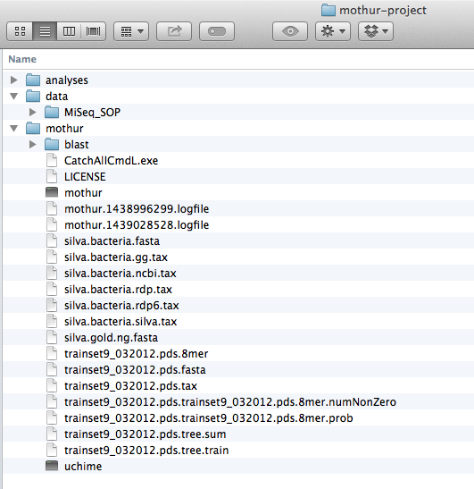

### Logistics
Instructor:
Tracy Teal <tkteal@datacarpentry.org> @tracykteal

Real-time notes for the class.  These will stay there after the workshop too.
 Etherpad:  https://etherpad.mozilla.org/Hj6zW6Ni3h

shell cheat sheets: 
[http://fosswire.com/post/2007/08/unixlinux-command-cheat-sheet/](http://fosswire.com/post/2007/08/unixlinux-command-cheat-sheet/)

[https://github.com/swcarpentry/boot-camps/blob/master/shell/shell_cheatsheet.md](https://github.com/swcarpentry/boot-camps/blob/master/shell/shell_cheatsheet.md)

### Overview of mothur
What you can use it for and what is the workflow in slides

[http://tracykteal.github.io/mothur-tutorial/mothur_stamps_presentation.pdf](http://tracykteal.github.io/mothur-tutorial/mothur_stamps_presentation.pdf)

#### Running mothur
You can run mothur on your own computer or an a remote computer. For this 
exercise we'll run it on your own computer, but in practice, you'll need 
to run it on a computer with more computational power, like on Amazon EC2
or computers at your university. The advantage of this is that it's not taking 
up computational resources on your own computer.
You could even start something and then close your computer and go home, or I mean 
go do some lab work. Also a lot of these analyses are just too computationally 
intensive to run on your own computer.

**Running it on your own computer**

Download mothur and install it from:

[http://www.mothur.org/wiki/Download_mothur](http://www.mothur.org/wiki/Download_mothur)
 (we're not going to talk about the GUI version)

You can also run mothur from within IPython Notebook with ipython-mothurmagic

[https://github.com/SchlossLab/ipython-mothurmagic](https://github.com/SchlossLab/ipython-mothurmagic)

Once you have it installed, on Mac, open a terminal, go in to the directory where you installed mothur
and type

   ./mothur

On Windows, double click on mothur and it will open a terminal with mothur.

**Running it on the MBL servers***

If you're on the servers, they uses the module system, so type  

   `module load mothur`

And then type  

   `mothur`  

---

Now you're in mothur, and we can start!  
You should get the command prompt  

   `mothur >`

Green sticky note up if you have the mothur command prompt

Once you have it up the first thing we'll do is quit mothur, so type  

   `quit()`  

If you're in mothur, or really any command line environment, you can type Ctrl^C to quit that command

**Getting help**  
mothur manual - [http://wiki.mothur.org/wiki/Mothur_manual](http://wiki.mothur.org/wiki/Mothur_manual)  
mothur user forum - [http://www.mothur.org/forum/](http://www.mothur.org/forum/)

### Set up your work environment

How are you going to keep track of all the commands you're running.  
Be nice to the you of 6 months or even a week from now!

Computational processes need lab notebooks just like lab work.

- Evernote
- OneNote
- Word
- a text editor
- IPython notebook
- photographic memory

In mothur if you run an analysis with different parameters in the same directory,
it will write over your old analysis.

mothur does always write out logfiles, so you can keep track with those some.

### mothur example

First let's create a directory for our analysis. mothur generates a lot of files,
so it's best to create a new directory for each analysis.

We'll want folders for our raw data, for our files that generated during the analysis 
and for the files mothur uses for reference. 

- On your Desktop or somewhere, create a directory 'mothur-project'
- Go in to that directory and create the directories 'data' and 'analyses'
- Move the 'mothur' folder that has the mothur program in
- Move the reference files in to the 'mothur' directory

So, your setup will look like this:

### The mothur MiSeq SOP

Go to the mothur MiSeq SOP. This is what we're going to go through.  

[http://www.mothur.org/wiki/MiSeq_SOP](http://www.mothur.org/wiki/MiSeq_SOP)

We're using the data from:

http://www.mothur.org/w/images/d/d6/MiSeqSOPData.zip

And the reference files from:

http://www.mothur.org/w/images/9/98/Silva.bacteria.zip  
http://www.mothur.org/w/images/5/59/Trainset9_032012.pds.zip

You also are welcome to use your own data as we go through things, but if you have too much data, each step
might take longer than we have planned.

We already have the files we need for this example, but let's take a look at some of them.  

To see what files you have type `ls`  
Now you see a list of files.
We have the fastq files.  Those are the files you get back from the sequencing center. 
Let's take a look at those.  

   `less F3D0_S188_L001_R1_001.fastq`

Then you have the stability.files file.  
That is a file that tells mothur what paired end sequences go together and what the sample name is.  
Let's take a look at that file.  

   `less stability.files`

You can see that the format is a tab delimited file with the sample name in the first column,
the forward read in the second column and the paired end read in the third column.  
You could create this file in Excel, then save it as a tab-delimited file.
It doesn't have to be called stability.file.  You can call it whatever you want.  The 'stability' part is just what it's named in the example.

Now let's start mothur again.  

If you're on the servers, you can just type  
`mothur`  

If you're on your own computer, go in to the directory with mothur. Then type

  ./mothur

And we're back in mothur.

The first thing we're going to do is to tell mothur where to look for the input files
and where to put the analysis files, using 'set.dir'

http://www.mothur.org/wiki/Set.dir

Set the input to where the data files are and the output to where you want the analyzed 
files to go.

It will create the 'first' directory, so this is a great way, if you're starting a new
analysis with different parameters to put them somewhere else.

   mothur > set.dir(input=../data/MiSeq_SOP, output=../analyses/first) 

Now let's start going through the protocol  
** Often the summary.seqs() commands take awhile.  Just wait and eventually you'll get the result

We're following the MiSeq SOP now, but we'll go through the first few commands, so that you can see how to access the data
and get the results file in your directory.

First we'll combine the paired-end reads together.  
For this we need the FASTQ files and the stability.files file that tells mothur what reads go together.

  `mothur > make.contigs(file=stability.files, processors=8)`

You'll wait a bit, and get some output.  
Four files will be created:  
* stability.trim.contigs.fasta - the FASTA file of the assembled paired end sequences
stability.contigs.report  - a report for each assembled contig of the overlap and number of Ns
stability.scrap.contigs.fasta - sequences that didn't pair
* stability.contigs.groups - a file with information on what sequence belongs to what sample

* files are ones that will be used in downstream analysis.  
In general, the *.fasta and *.groups files are the ones you'll need in the next steps.

--------- BREAK -------------  
We're going to pause here and when we come back, we'll start going through the workflow

Notes along the workflow

At the pcr.seqs command, we're not going to rename the file, so the next command is:

   align.seqs(fasta=stability.trim.contigs.good.unique.fasta, reference=silva.bacteria.pcr.fasta)

At the remove.seqs command, the command should be

   `remove.seqs(fasta=stability.trim.contigs.good.unique.good.filter.unique.precluster.fasta, accnos=stability.trim.contigs.good.unique.good.filter.unique.precluster.denovo.uchime.accnos)`

The remove.lineage line should be

   `remove.lineage(fasta=stability.trim.contigs.good.unique.good.filter.unique.precluster.pick.fasta, count=stability.trim.contigs.good.unique.good.filter.unique.precluster.denovo.uchime.pick.count_table, taxonomy=stability.trim.contigs.good.unique.good.filter.unique.precluster.pick.pds.wang.taxonomy, taxon=Chloroplast-Mitochondria-unknown-Archaea-Eukaryota)`

Then

   `get.groups(count=stability.trim.contigs.good.unique.good.filter.unique.precluster.denovo.uchime.pick.pick.count_table, fasta=stability.trim.contigs.good.unique.good.filter.unique.precluster.pick.pick.fasta, groups=Mock)`

remove.groups

   `remove.groups(count=stability.trim.contigs.good.unique.good.filter.unique.precluster.denovo.uchime.pick.pick.count_table, fasta=stability.trim.contigs.good.unique.good.filter.unique.precluster.pick.pick.fasta, taxonomy=stability.trim.contigs.good.unique.good.filter.unique.precluster.pick.pds.wang.pick.taxonomy, groups=Mock)`

cluster

   `cluster(column=stability.trim.contigs.good.unique.good.filter.unique.precluster.pick.pick.pick.dist, count=stability.trim.contigs.good.unique.good.filter.unique.precluster.denovo.uchime.pick.pick.pick.count_table)`

cluster.split

   `cluster.split(fasta=stability.trim.contigs.good.unique.good.filter.unique.precluster.pick.pick.pick.fasta, count=stability.trim.contigs.good.unique.good.filter.unique.precluster.denovo.uchime.pick.pick.pick.count_table, taxonomy=stability.trim.contigs.good.unique.good.filter.unique.precluster.pick.pds.wang.pick.pick.taxonomy, splitmethod=classify, taxlevel=4, cutoff=0.15)`

Creating the distance matrix and doing the clustering are the time and memory intensive steps.

Once we create the shared file, there are several things we can do.
Let's take a look at the shared file though. Let's open it in Excel.
[stability.trim.contigs.good.unique.good.filter.unique.precluster.pick.pick.pick.an.unique_list.shared](img/stability.trim.contigs.good.unique.good.filter.unique.precluster.pick.pick.pick.an.unique_list.shared)

Let's also look at the list file  
[stability.trim.contigs.good.unique.good.filter.unique.precluster.pick.pick.pick.an.unique_list.list](img/stability.trim.contigs.good.unique.good.filter.unique.precluster.pick.pick.pick.an.unique_list.list)

There's been a lot of discussion of what to do with the raw counts:  
- subsample
- normalize by sample size
- mixed model
- something else

For this lesson we're going to subsample

See how many sequences we have  
`mothur > count.groups()`

Lowest is 2441, so we'll subsample to that size  
`mothur > sub.sample(shared=stability.trim.contigs.good.unique.good.filter.unique.precluster.pick.pick.pick.an.unique_list.shared, size=2441)`  
Now we have a new shared file that has been subsampled. If we did the subsampling again, we'd actually get a different new shared file.  

** Exercise

Go ahead and try it. Open up your new shared file. Rerun the subsampling and see if the re-subsampled one looks the same.
This is easiest if you're running it on your own computer. Pair up with someone who is if you're not.

### Looking at some of this data

PAST - a GUI statistical package developed by Oyvind Hammer  
[http://folk.uio.no/ohammer/past/](http://folk.uio.no/ohammer/past/)

### Running mothur in batch mode

### Creating your own 'stability.file' for your data

### Past the shared file

- Classify
- Alpha and beta diversity
- Data visualization
